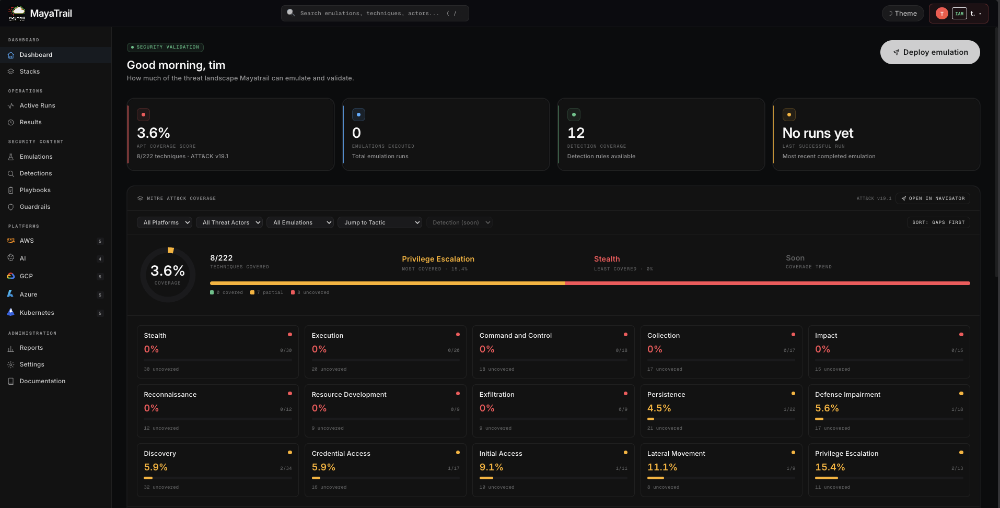
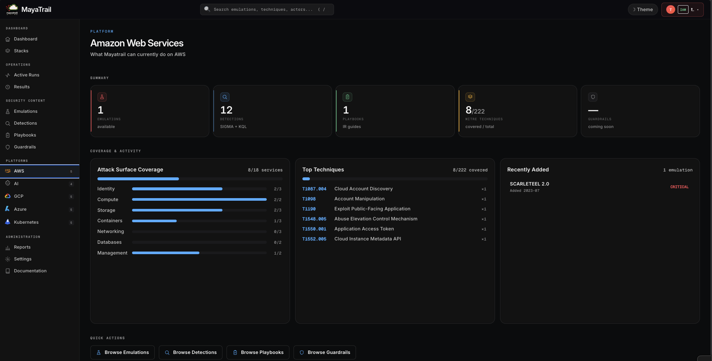

<!-- PLACEHOLDER: replace with MayaTrail logo -->
<!-- <p align="center"></p> -->

<h1 align="center">MayaTrail</h1>

<p align="center">
  <strong>Rehearse real cloud attacks safely — in your own AWS account, before attackers do.</strong>
</p>

<p align="center">
  MayaTrail connects to your AWS account, provisions a realistic, intentionally vulnerable
  environment, runs a real adversary emulation against it, and shows you exactly what an
  attacker could reach — then tears it all down automatically. Every emulation ships with
  MITRE ATT&CK mappings and ready-to-deploy detection rules.
</p>

<!-- PLACEHOLDER: badges — add once CI / license / release are public -->
<p align="center">
  <!--  -->
  <!--  -->
  <!--  -->
</p>

---

## The problem

Cloud misconfiguration is the leading cause of cloud breaches — a single over-permissive IAM
role or an EC2 instance with IMDSv1 enabled is enough to lose an account. Yet security teams
have almost no safe way to *rehearse* these attacks against infrastructure that looks like
their own:

- **Production is too risky to attack.** You can't run a credential-theft-to-persistence chain
  against live infrastructure to see if it works.
- **Pentests are expensive and infrequent.** A point-in-time engagement once or twice a year
  doesn't keep pace with infrastructure that changes daily.
- **Knowing about a misconfiguration isn't the same as knowing your blast radius.** Most tools
  flag that IMDSv1 is on; they don't show you the full kill chain it unlocks — or whether your
  detections would catch it.

The result: teams discover whether their cloud is exploitable only when a real attacker shows
them.

## The solution

MayaTrail closes the loop — **connect → deploy → attack → observe → auto-destroy** — running
real adversary emulations inside an isolated, disposable environment in *your own* AWS account.

1. **Connect** your AWS account via STS AssumeRole — no long-lived keys to hand over.
2. **Deploy** a realistic, intentionally vulnerable environment from code (Pulumi).
3. **Attack** it with a real adversary emulation modelled on a documented campaign.
4. **Observe** the outcome in a dashboard: the kill chain, MITRE ATT&CK coverage, blast
   radius, and an immutable audit log — plus detection rules you can take straight to your SIEM.
5. **Auto-destroy** — every environment has a TTL, so nothing lingers and costs stay bounded.

Spin it up, run the breach, learn from it, and let it clean itself up. Repeat as often as your
infrastructure changes.

<p align="center">
  
</p>

## Who it's for

MayaTrail is built for the people responsible for cloud security posture:

| Persona | What they get from MayaTrail |
|---|---|
| **Detection Engineer** | Real attacker telemetry plus shipped Sigma + KQL rules to validate and tune detections against. |
| **Security Engineer** | A safe range to validate whether a misconfiguration is actually exploitable end-to-end. |
| **Cloud Security Engineer** | Realistic, documented attack scenarios run safely inside their own AWS account. |
| **DevSecOps Engineer** | Disposable, IaC-defined environments that fit into existing pipelines. |
| **SOC Analyst** | A controlled environment to study real attack patterns and response. |
| **Security Architect** | Evidence of blast radius to inform guardrails and policy decisions. |

## Key capabilities

- **Runs in your own AWS account** — connection is via scoped STS AssumeRole; no long-lived
  credentials are stored.
- **Real-world adversary emulations** — modelled on documented campaigns, not toy scenarios.
- **Mapped to MITRE ATT&CK** — every phase is tied to a technique, with coverage surfaced on
  the dashboard.
- **Ships detection rules** — each emulation includes Sigma and KQL rules and an
  incident-response playbook, ready for your SIEM.
- **Ephemeral and cost-aware** — environments carry a TTL and are auto-destroyed on a schedule;
  cost estimates are shown up front.
- **Plugin-based emulation packages** — drop in a new emulation package and it's
  auto-discovered, infra and detections included.
- **Auditable** — an immutable log records every connect, deploy, attack, and destroy.

## Why now

Cloud footprints are growing faster than the teams defending them, and the discipline is
shifting from point-in-time pentests toward **continuous threat exposure management** — always
knowing whether your environment is exploitable today, not last quarter. MayaTrail makes that
rehearsal loop cheap, safe, and repeatable enough to run continuously.

## Roadmap

`step1` is the first phase of a deliberately staged platform. Direction ahead:

- A growing library of adversary emulations across more documented campaigns
- Multi-cloud support (Azure, GCP, Kubernetes) — the platform model already accounts for it
- Deeper detection-engineering workflows built on emulation telemetry
- CI/CD integration to rehearse attacks on every infrastructure change

---

> The sections below are technical reference for running and contributing to MayaTrail.

## How it works

MayaTrail runs as a full-stack web application. The flow for a single emulation:

1. **Connect** — a user connects their AWS account; the `connectors` app establishes access via
   STS AssumeRole (no long-lived keys are stored).
2. **Deploy** — the enterprise Celery worker provisions the emulation's infrastructure into the
   user's account using the **Pulumi Automation API, in-process** (no Docker socket, no
   ephemeral Pulumi containers). Pulumi state lives in a dedicated S3 state bucket.
3. **Attack** — the emulation package's `attack.py` executes the kill chain against the
   freshly provisioned infrastructure.
4. **Observe** — results, MITRE ATT&CK mappings, and detection rules surface in the dashboard;
   the `logs` app records an immutable audit trail.
5. **Auto-destroy** — each stack carries a TTL (SCARLETEEL defaults to 4 hours); Celery Beat
   runs an auto-destroy task every 15 minutes so expired environments are cleaned up and costs
   stay bounded.

## Quick start (Docker Compose)

```bash
# 1. Configure environment
cp backend/.env.example backend/.env
# Fill in SECRET_KEY, AWS credentials, and STATE_BUCKET in backend/.env

# 2. Start the full stack
docker-compose up --build
```

The application is available at `http://localhost`. Migrations run automatically on backend
startup.

**Prerequisites:** Docker and Docker Compose, plus AWS credentials for the platform account
(used to AssumeRole into target accounts and to store Pulumi state).

### Key environment variables (`backend/.env`)

| Variable | Description |
|---|---|
| `SECRET_KEY` | Django secret key |
| `DATABASE_URL` | PostgreSQL connection string |
| `REDIS_URL` | Celery broker + result backend |
| `AWS_ACCESS_KEY_ID` / `AWS_SECRET_ACCESS_KEY` | Platform AWS credentials (STS AssumeRole + state bucket) |
| `AWS_DEFAULT_REGION` | Default AWS region (e.g. `ap-south-1`) |
| `STATE_BUCKET` | S3 bucket for Pulumi state (e.g. `mayatrail-state-bucket`) |
| `PULUMI_CONFIG_PASSPHRASE` | Passphrase for Pulumi stack secrets |
| `EMULATIONS_BASE_DIR` | Where emulation packages are mounted (`/opt/emulations`) |
| `REGISTRATION_INVITE_CODE` | Invite code gating self-registration |
| `GOOGLE_CLIENT_ID` | Google SSO client ID |

### Frontend development

```bash
cd frontend/UI
npm install
npm run dev    # Vite dev server on http://localhost:3000
```

## Emulations

MayaTrail ships adversary emulations as self-contained, auto-discovered packages. Each package
bundles everything needed to run and learn from the attack:

- `MANIFEST.py` — identity, kill-chain phases, MITRE ATT&CK mappings, cost and TTL metadata
- `attack.py` — a `run(outputs)` function that executes the kill chain
- `infra/` — a Pulumi program that provisions the vulnerable environment
- `detections/` — Sigma and KQL detection rules, one set per technique
- `PLAYBOOK.md` — an incident-response playbook for the campaign

### SCARLETEEL 2.0

A 6-phase APT emulation based on the real-world SCARLETEEL campaign documented by the Sysdig
Threat Research Team (2023). It chains container exploitation with AWS credential theft to
achieve lateral movement, data exfiltration, and persistence.

| Phase | Tactic | MITRE technique(s) |
|---|---|---|
| 1. Initial Access | Initial Access | `T1190` Exploit Public-Facing Application (container RCE) |
| 2. Credential Access | Credential Access | `T1552.005` Cloud Instance Metadata API (IMDSv1) |
| 3. Discovery | Discovery | `T1087.004` Cloud Account Discovery · `T1580` Cloud Infrastructure Discovery |
| 4. Defense Evasion | Defense Evasion | `T1562.008` Disable Cloud Logs (CloudTrail) |
| 5. Lateral Movement | Privilege Escalation / Lateral Movement | `T1548.005` Abuse Elevation Control (AssumeRole) · `T1550.001` Application Access Token |
| 6. Persistence | Persistence | `T1098` Account Manipulation (Lambda backdoor) |

**Severity:** CRITICAL · **Duration:** ~20 min · **Resources:** 19 · **Default TTL:** 4 hours ·
**Est. cost:** ~$0.05/hr
**Services exercised:** IAM, STS, EC2, Lambda, S3, Secrets Manager, ECS, CloudTrail
**Detections shipped:** Sigma + KQL rules for T1190, T1552.005, T1087.004, T1562.008,
T1548.005, and T1098, plus a full incident-response playbook.

<p align="center">
  
</p>

## Docker Compose stack

The full platform runs as a Docker Compose stack with 7 services:

| Service | Purpose |
|---|---|
| `db` | PostgreSQL 16 database |
| `redis` | Celery message broker + result backend |
| `backend` | Django REST API (Gunicorn) |
| `worker_enterprise` | Celery worker — deploys, attacks, and destroys emulations in the user's AWS account via STS AssumeRole (Pulumi Automation API, in-process) |
| `beat` | Celery Beat scheduler — auto-destroys expired stacks every 15 minutes |
| `ui` | React SPA (Nginx, non-root) |
| `nginx` | Edge reverse proxy (routes `/` to UI, `/api/` + `/admin/` to backend) |

## Project structure

```shell
step1/
├── backend/                    # Django REST API
│   ├── apps/
│   │   ├── users/              # Auth: registration (invite code), JWT login, Google SSO, profile
│   │   ├── connectors/         # AWS account connection via STS AssumeRole
│   │   ├── emulations/         # Emulation catalogue + run lifecycle (deploy/attack/destroy)
│   │   ├── infrastructure/     # Stack model, Celery tasks, TTL auto-destroy
│   │   ├── metrics/            # Platform Overview dashboard metrics (MITRE + attack-surface coverage)
│   │   └── logs/               # Read-only audit log
│   ├── config/                 # Django settings (base/dev/prod), Celery, URLs
│   ├── Dockerfile              # Backend / beat image
│   ├── Dockerfile.worker       # Enterprise worker image
│   └── requirements.txt
├── emulations/                 # Adversary emulation packages (mounted at /opt/emulations)
│   ├── registry.py             # Auto-discovers packages via MANIFEST.py
│   └── scarleteel/             # SCARLETEEL 2.0 emulation
│       ├── MANIFEST.py         # Identity, MITRE mappings, cost + TTL metadata
│       ├── attack.py           # run(outputs) — executes the kill chain
│       ├── infra/              # Pulumi program (vulnerable infrastructure)
│       ├── detections/         # Sigma + KQL detection rules per technique
│       └── PLAYBOOK.md         # Incident-response playbook
├── frontend/UI/                # React + TypeScript SPA
│   ├── src/
│   │   ├── components/         # dashboard, emulations, playbooks, detections, platforms, ...
│   │   ├── context/            # Auth, Theme, Platform contexts
│   │   ├── services/           # API service layer (Axios)
│   │   ├── data/               # Static taxonomies (e.g. attack-surface mapping)
│   │   └── types/              # TypeScript type definitions
│   ├── DESIGN.md               # Frontend design system (source of truth)
│   └── Dockerfile              # Multi-stage: Node build -> Nginx
├── docker-compose.yml          # Full stack orchestration (7 services)
└── nginx.conf                  # Edge reverse proxy config
```

## Contributing

Good entry points for understanding the codebase:

- `docker-compose.yml` — the full service topology and how the pieces connect
- `emulations/scarleteel/` — a complete emulation package (manifest, attack, infra, detections, playbook)
- `frontend/UI/DESIGN.md` — the frontend design system; read it before any UI change

Adding a new emulation is the most common contribution: create a package under `emulations/`
with a `MANIFEST.py` and an `attack.py` exposing `run(outputs)`, and the registry will discover
it automatically.

---

> **Safety note:** MayaTrail provisions intentionally vulnerable AWS resources inside the
> connected account. Use only a dedicated, isolated test account. Environments auto-destroy on
> their TTL, and you can also tear them down on demand from the dashboard.
